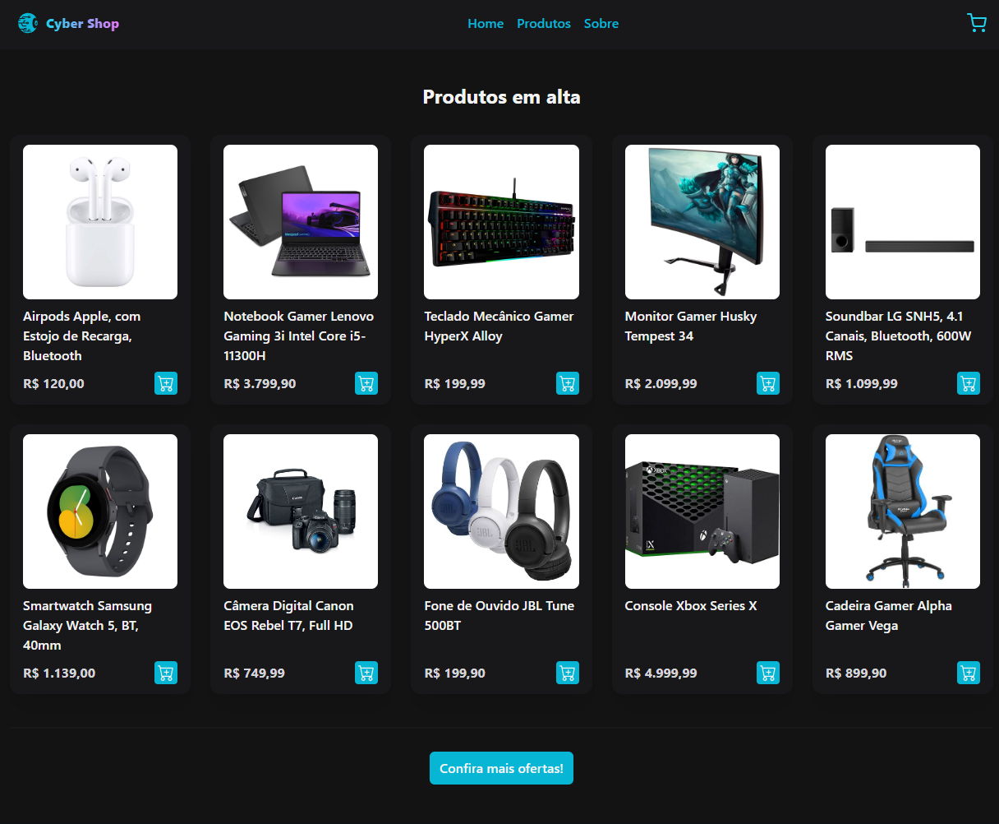

<div align="center">
  <h1 align="center">💱CyberShop Cart.<br> made with React, Vite.js, and Typescript. ⚛</h1>
</div>
 
&nbsp;

<p align="center">
  <a href="#technologies">Technologies</a>&nbsp;&nbsp;&nbsp;|&nbsp;&nbsp;&nbsp;
  <a href="#project">Project</a>&nbsp;&nbsp;&nbsp;|&nbsp;&nbsp;&nbsp;
  <a href="#license">License</a>
</p>

<p align="center">
 
  
  
</p>
&nbsp;
&nbsp;
&nbsp;



&nbsp;

## 📖 Sobre o projeto

O projeto **CyberShop Cart** é uma aplicação web desenvolvida com React.js, Vite.js e Typescript que simula um carrinho de compras de e-commerce. O objetivo é permitir ao usuário adicionar produtos ao carrinho, visualizar os itens adicionados, calcular o total da compra e finalizar o pedido.

## 💻 Tecnologias utilizadas no projeto

- [React.js](https://reactjs.org) (v18)
- [Vite.js](https://vitejs.dev) (v3)
- [Typescript](https://www.typescriptlang.org) (v5)
- [Context API](https://reactjs.org/docs/context.html)
- [react-icons](https://react-icons.github.io/react-icons/)
- [react-hot-toast](https://react-hot-toast.com/)

## 🗄️ Estrutura de pastas

O projeto está estruturado da seguinte forma:

- 📁 `public`
- 📁 `src`
  - 📁 `components`
    - 📁 `CartItem`
    - 📁 `CartList`
    - 📁 `Product`
    - 📁 `ProductList`
    - 📁 `Header`
  - 📁 `contexts`
  - 📁 `assets`
  - 📁 `hooks`
  - ⚛️ `App.tsx`
  - ⚛️ `index.tsx`
  - ⚛️ `types.ts`

## 🛠️ Instruções de execução

Siga as instruções abaixo para rodar o projeto em seu ambiente local:

1. Certifique-se de ter o Node.js instalado em seu computador. Você pode baixar a versão mais recente do Node.js em https://nodejs.org.

2. Clone este repositório em seu computador ou faça o download do código fonte.

    ```bash
    git clone https://github.com/jhonatan-oliveiradev/cyber-shop-cart.git
    ```


3. Abra o terminal e navegue até o diretório raiz do projeto:

   ```bash
   cd cyber-shop-cart
   ```

4. Instale as dependências do projeto:

   ```bash
    npm install
    ```

5. Inicie o servidor de desenvolvimento:

    ```bash
    npm run dev
    ```

6. Acesse o endereço http://localhost:5173 em seu navegador para visualizar o projeto.

Caso a porta 5173 estiver em uso, automaticamente o Vite.js irá subir na próxima porta livre da máquina.

Se deseja alterar a porta padrão na qual a aplicação tentará subir, você pode modificar a porta no arquivo vite.config.js.

Agora você está pronto para explorar o projeto em seu ambiente local!

## 🎨 Protótipo do projeto


## 📝 Licença

Este projeto está sob a licença MIT. Consulte o arquivo [LICENSE](LICENSE) para obter mais informações.

<hr>

# Feature: Finalizar Pedido

## Requisitos

 - O usuário deve ser capaz de adicionar produtos ao carrinho.
 - O usuário deve ser capaz de visualizar os itens adicionados ao carrinho.
 - O usuário deve ser capaz de calcular o total da compra.
 - O usuário deve ser capaz de finalizar o pedido.

<hr>

Feito com 💜 por [Jhonatan Oliveira](https://www.jhonatanoliveira.com).